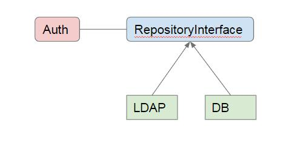

# Authentication Config

## auth config file

Slimer for now support local DB and LDAP mixing authentication. According to user's type to decide how to do the authentication when login Slimer.

> auth.php config file setup LDAP server 

Any authentication relevant config info, recommand add into this file.

[Symfony LDAP](https://symfony.com/doc/current/security/ldap.html) Slimer take advantage symfony LDAP module to deal with the LDAP access. 

```PHP
<?php
/**
 * Author: Shawn Chen
 * Desc:
 */
return [
    'entity' => 'user', // user entity
    'storage' => \Slimer\Auth\Storage\Session::class, // can be Session, Cookie, JWT
    'repository' => \Slimer\Auth\Repository\LDAP::class, // default Db repository
    'rbac' => [ // will be discarded
        'defaultRole' => 'anonymous', // default unauthorized role
        'errorCallback' => null
    ],
    'ldap' => [
        'server' => [
            'host' => '<your ldap server>',
            'port' => 389,
            'encryption' => 'none',
            'options' => [
                'protocol_version' => 3,
                'referrals' => true,
            ],
        ],
        'admin' => [
            'dn' => 'searchID=XX,ou=people,ou=intranet,dc=XXXX,dc=com',
            'password' =>'*****',
        ],
        'userDn' => 'searchID=%s,ou=people,ou=intranet,dc=XXXX,dc=com',
        'baseDN' => 'ou=people,ou=intranet,dc=XXXX,dc=com',
        'fields' => [
            'login' => ['id','uid', 'mail'],
            'loginInDb' => 'loginName',
            'map' => [
                'cn' => 'userName',
                'sn' =>'lastName',
                'givenName' => 'firstName',
                'mail' => 'email',
            ],
        ],
     ]
];
```

## auth interface desing

Slimer make an Auth Class to facade all of the inner authenticate repository. Slimer has Repository and Storage to indicate different authentication way and the response storeage type.

> auth_repository

A authentication repository service registed in the DI container via the Privader. Slimer has builtin Db and LDAP type authentication in the Slimer/Auth/Repository folder. Both of them implement RepositoryInterface.

It is configed in the above Auth config to define which repository class used. The LDAP authentication is the default.



> auth_storage

Slimer make in interface named **StorageInterface** define some function to store the authentication response. And has an implementation Session.php in Slimer/Auth/Storage to store the response in the session scope.

