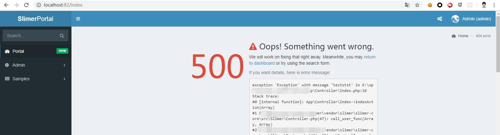

# Error Handler

Slimer overwrite App error handler based on [Slim error handler](http://www.slimframework.com/docs/v3/handlers/error.html)

## ErrorHandler.php

Slimer has an ErrorHandler.php file to handle the all of the framework error including PHP runtime error.

```php
<?php
/**
 * Author: Shawn Chen
 * Desc: The Slim error handler extention
 */
namespace Slimer;

use Psr\Http\Message\ResponseInterface;
use Psr\Http\Message\ServerRequestInterface;
use Exception;

class ErrorHandler extends \Slimer\Controller
{
    /**
     * Handle exception.
     *
     * @param ServerRequestInterface $request
     * @param ResponseInterface      $response
     * @param Exception              $e
     *
     * @return ResponseInterface
     */
    public function error500(ServerRequestInterface $request, ResponseInterface $response, Exception $e)
    {
        $this->logger->error($request->getUri()->__toString(), ['code' => 500, 'exception' => $e]);
        $message = $this->config('suit.settings.displayErrorDetails') ? $e->__toString() : $e->getMessage();
        
        return $this->render('error/500.html', ['message' => $message], 500);
    }
    
    /**
     * Handle not found error.
     *
     * @param ServerRequestInterface $request
     * @param ResponseInterface      $response
     *
     * @return ResponseInterface
     */
    public function error404(ServerRequestInterface $request, ResponseInterface $response)
    {
        $this->logger->error($request->getUri()->__toString(), ['code' => 404]);
        
        return $this->render('error/404.html', [], 404);
    }
    
        /**
     * Handle permission error.
     *
     * @param ServerRequestInterface $request
     * @param ResponseInterface      $response
     *
     * @return ResponseInterface
     */
    public function error403(ServerRequestInterface $request, ResponseInterface $response)
    {
        $this->logger->error($request->getUri()->__toString(), ['code' => 403, 'message' => "permission denied"]);        
        return $this->render('error/403.html', ['perm' => $request->getAttribute('perm')], 403);
    }
}

```
> Integrate the customized error handler into the Slimer.

```php
  protected function setErrorHandler(Container $container)
    {
        return function (Container $container) {
            return function (ServerRequestInterface $request, ResponseInterface $response, Exception $e) use ($container) {
                if ($container->has('appErrorHandler')) {
                    return $container['appErrorHandler']->error500($request, $response, $e);
                }
                
                return $response->withStatus(500);
            };
        };
    }
```




