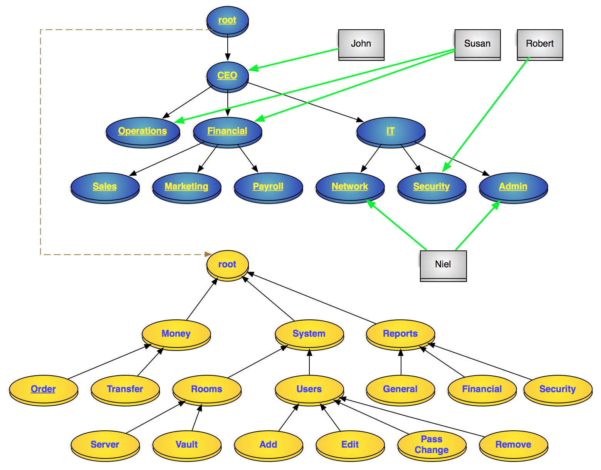
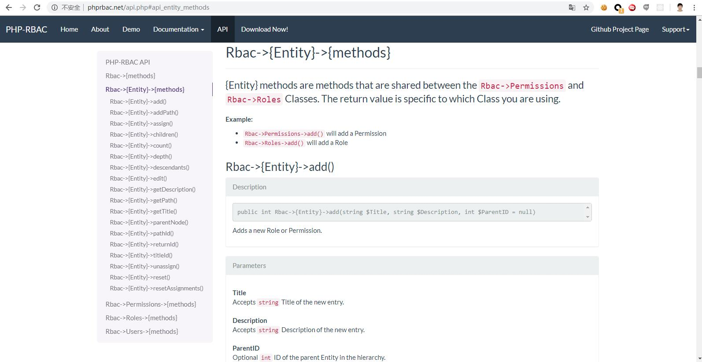
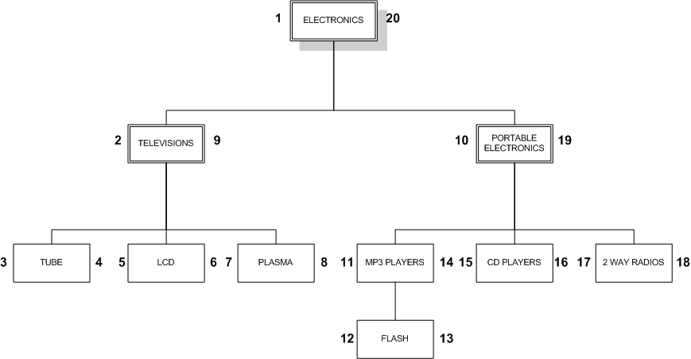

# PHP RBAC

Slimer RBAC controlling based on PHP RBAC. [phprbac](http://phprbac.net/)

Source code [owasp/rbac](https://github.com/OWASP/rbac)

## NIST Level 2 RBAC

> Sample roles and permission hierarchical NIST Level 2




> PHP RBAC API



## DB Nested Set Model

Refer [Hierarchical-data-in-mysql](http://mikehillyer.com/articles/managing-hierarchical-data-in-mysql/)

**The Nested Set Model**
What I would like to focus on in this article is a different approach, commonly referred to as the Nested Set Model. In the Nested Set Model, we can look at our hierarchy in a new way, not as nodes and lines, but as nested containers. Try picturing our electronics categories this way:


Notice how our hierarchy is still maintained, as parent categories envelop their children.We represent this form of hierarchy in a table through the use of left and right values to represent the nesting of our nodes:

```SQL
CREATE TABLE nested_category (
        category_id INT AUTO_INCREMENT PRIMARY KEY,
        name VARCHAR(20) NOT NULL,
        lft INT NOT NULL,
        rgt INT NOT NULL
);

INSERT INTO nested_category VALUES(1,'ELECTRONICS',1,20),(2,'TELEVISIONS',2,9),(3,'TUBE',3,4),
 (4,'LCD',5,6),(5,'PLASMA',7,8),(6,'PORTABLE ELECTRONICS',10,19),(7,'MP3 PLAYERS',11,14),(8,'FLASH',12,13),
 (9,'CD PLAYERS',15,16),(10,'2 WAY RADIOS',17,18);

SELECT * FROM nested_category ORDER BY category_id;

+-------------+----------------------+-----+-----+
| category_id | name                 | lft | rgt |
+-------------+----------------------+-----+-----+
|           1 | ELECTRONICS          |   1 |  20 |
|           2 | TELEVISIONS          |   2 |   9 |
|           3 | TUBE                 |   3 |   4 |
|           4 | LCD                  |   5 |   6 |
|           5 | PLASMA               |   7 |   8 |
|           6 | PORTABLE ELECTRONICS |  10 |  19 |
|           7 | MP3 PLAYERS          |  11 |  14 |
|           8 | FLASH                |  12 |  13 |
|           9 | CD PLAYERS           |  15 |  16 |
|          10 | 2 WAY RADIOS         |  17 |  18 |
+-------------+----------------------+-----+-----+
```

We use **lft** and **rgt** because left and right are reserved words in MySQL, see http://dev.mysql.com/doc/mysql/en/reserved-words.html for the full list of reserved words.

So how do we determine left and right values? We start numbering at the leftmost side of the outer node and continue to the right:

This design can be applied to a typical tree as well:

When working with a tree, we work from left to right, one layer at a time, descending to each node’s children before assigning a right-hand number and moving on to the right. This approach is called the modified preorder tree traversal algorithm.

**RETRIEVING A FULL TREE**
We can retrieve the full tree through the use of a self-join that links parents with nodes on the basis that a node’s lft value will always appear between its parent’s lft and rgt values:
```SQL
SELECT node.name
FROM nested_category AS node,
        nested_category AS parent
WHERE node.lft BETWEEN parent.lft AND parent.rgt
        AND parent.name = 'ELECTRONICS'
ORDER BY node.lft;

+----------------------+
| name                 |
+----------------------+
| ELECTRONICS          |
| TELEVISIONS          |
| TUBE                 |
| LCD                  |
| PLASMA               |
| PORTABLE ELECTRONICS |
| MP3 PLAYERS          |
| FLASH                |
| CD PLAYERS           |
| 2 WAY RADIOS         |
+----------------------+
```

Unlike our previous examples with the adjacency list model, this query will work regardless of the depth of the tree. We do not concern ourselves with the rgt value of the node in our BETWEEN clause because the rgt value will always fall within the same parent as the lft values.

**FINDING ALL THE LEAF NODES**
Finding all leaf nodes in the nested set model even simpler than the LEFT JOIN method used in the adjacency list model. If you look at the nested_category table, you may notice that the lft and rgt values for leaf nodes are consecutive numbers. To find the leaf nodes, we look for nodes where rgt = lft + 1:
```SQL
SELECT name
FROM nested_category
WHERE rgt = lft + 1;

+--------------+
| name         |
+--------------+
| TUBE         |
| LCD          |
| PLASMA       |
| FLASH        |
| CD PLAYERS   |
| 2 WAY RADIOS |
+--------------+
```

**RETRIEVING A SINGLE PATH**

With the nested set model, we can retrieve a single path without having multiple self-joins:
```SQL
SELECT parent.name
FROM nested_category AS node,
        nested_category AS parent
WHERE node.lft BETWEEN parent.lft AND parent.rgt
        AND node.name = 'FLASH'
ORDER BY parent.lft;

+----------------------+
| name                 |
+----------------------+
| ELECTRONICS          |
| PORTABLE ELECTRONICS |
| MP3 PLAYERS          |
| FLASH                |
+----------------------+
```




> FINDING THE DEPTH OF THE NODES

We have already looked at how to show the entire tree, but what if we want to also show the depth of each node in the tree, to better identify how each node fits in the hierarchy? This can be done by adding a COUNT function and a GROUP BY clause to our existing query for showing the entire tree:

```SQL

SELECT node.name, (COUNT(parent.name) - 1) AS depth
FROM nested_category AS node,
        nested_category AS parent
WHERE node.lft BETWEEN parent.lft AND parent.rgt
GROUP BY node.name
ORDER BY node.lft;

+----------------------+-------+
| name                 | depth |
+----------------------+-------+
| ELECTRONICS          |     0 |
| TELEVISIONS          |     1 |
| TUBE                 |     2 |
| LCD                  |     2 |
| PLASMA               |     2 |
| PORTABLE ELECTRONICS |     1 |
| MP3 PLAYERS          |     2 |
| FLASH                |     3 |
| CD PLAYERS           |     2 |
| 2 WAY RADIOS         |     2 |
+----------------------+-------+
```

We can use the depth value to indent our category names with the CONCAT and REPEAT string functions:

```SQL
SELECT CONCAT( REPEAT(' ', COUNT(parent.name) - 1), node.name) AS name
FROM nested_category AS node,
        nested_category AS parent
WHERE node.lft BETWEEN parent.lft AND parent.rgt
GROUP BY node.name
ORDER BY node.lft;

+-----------------------+
| name                  |
+-----------------------+
| ELECTRONICS           |
|  TELEVISIONS          |
|   TUBE                |
|   LCD                 |
|   PLASMA              |
|  PORTABLE ELECTRONICS |
|   MP3 PLAYERS         |
|    FLASH              |
|   CD PLAYERS          |
|   2 WAY RADIOS        |
+-----------------------+

```

> DEPTH OF A SUB-TREE

When we need depth information for a sub-tree, we cannot limit either the node or parent tables in our self-join because it will corrupt our results. Instead, we add a third self-join, along with a sub-query to determine the depth that will be the new starting point for our sub-tree:

```SQL
SELECT node.name, (COUNT(parent.name) - (sub_tree.depth + 1)) AS depth
FROM nested_category AS node,
        nested_category AS parent,
        nested_category AS sub_parent,
        (
                SELECT node.name, (COUNT(parent.name) - 1) AS depth
                FROM nested_category AS node,
                nested_category AS parent
                WHERE node.lft BETWEEN parent.lft AND parent.rgt
                AND node.name = 'PORTABLE ELECTRONICS'
                GROUP BY node.name
                ORDER BY node.lft
        )AS sub_tree
WHERE node.lft BETWEEN parent.lft AND parent.rgt
        AND node.lft BETWEEN sub_parent.lft AND sub_parent.rgt
        AND sub_parent.name = sub_tree.name
GROUP BY node.name
ORDER BY node.lft;

+----------------------+-------+
| name                 | depth |
+----------------------+-------+
| PORTABLE ELECTRONICS |     0 |
| MP3 PLAYERS          |     1 |
| FLASH                |     2 |
| CD PLAYERS           |     1 |
| 2 WAY RADIOS         |     1 |
+----------------------+-------+
```

> More sql commands related hierical operation please refer the [Hierarchical-data-in-mysql](http://mikehillyer.com/articles/managing-hierarchical-data-in-mysql/)