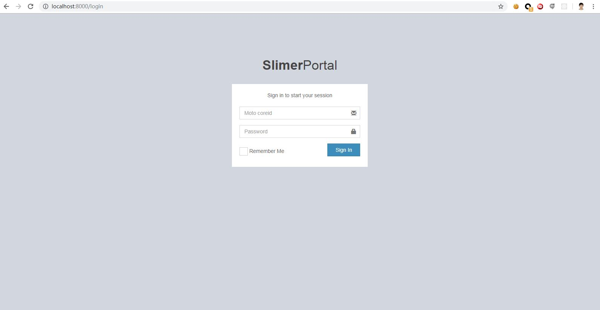

# Getting started

I'm working on develop a scaffold tool to bring up the Slimer initiation simpler than clone the source code from [cw1427/Slimer](https://github.com/cw1427/Slimer). But right now please follow below guidance to have a tour.

## Start tour from here

I'm assuging you have a total PHP5.6.* interpreter env ready.

- **Step 1**
    
  ` git clone git@github.com:cw1427/Slimer.git`

- **Step 2**

 Cd to the project root folder, run below command to install the dependencies via Composer

 `php composer.phar install`

 In case of the composer.lock been out-of-date, recommend to run composer update to force upgrade

 `php composer.phar update`

- **Step 3 (optional)**

  If you have your local composer registry server, please add below code in the composer.json file
        "repositories": [
        {
            "type": "composer",
            "url": "https://<your private composer registry>/packagist"
        },
        {
            "type": "composer",
            "url": "https://<your private composer registry>/packagistremote/"
        },
		{
			"packagist": false
        }
        ],

  If your composer registry server need authentication, please update the account info in the auth.json file under the project path.
        {
        "http-basic": {
            "<your private composer url>": {
            "username": "composer",
            "password": "<the account password>"
            }
        } 
        }

- **Step 4 (optional)**

  Run the command to check if evething gos well `php index.php cmd --list`
  As default there is a builtin Sqlite DB app.db file in the project. But you can use the commands to initiate to your DB.
  Please refer [DB config](./db-config.md) if you need.
        `
        $ php index.php cmd --list
        Command Name: cmd
        Description: List current supported Commands names
        Avaliable parameter list:
        --list|-l : List all of the commands


        Command Name: sampletask
        - 0


        Command Name: dbinit
        Description: Basic DB init command, will check if the user table exists or not and help to reset the admin account
        Avaliable parameter list:
        --sync : Check if user table exists if not then help to create it
        --dbType : Provide the current db type, default is mysql,: mysql|sqlite|pgsql
        --dbEngine : The name of db engine in this App


        Command Name: rbacinit
        Description: Basic RBAC tables structure init, it will depends owasp/phprbac library
        Avaliable parameter list:
        --sql_path : The RBAC tables init sql path, the default=<vendor>/owasp/phprbac/PhpRbac/database/mysql.sql
        --dbType : Provide the current db type, default is mysql,: mysql|sqlite|pgsql
        --dbEngine : The name of db engine in this App


        Command Name: rbacreset
        Description: RBAC initial data reset including the config basic permission data, it will depends owasp/phprbac library
        Avaliable parameter list:
        --force : need to explict force reset the rbac structure


        Command Name: rbacmanage
        Description: Basic RBAC tables structure init, it will depends owasp/phprbac library
        Avaliable parameter list:
        --role : The role title you want to manage
        --type : The manage type, for now only support for add|delete|assign|unassign|show
        --desc : The description
        --perm : The perm title you want to manage
        --parent : The parent title or path what you want to manage belong to
        --recurisive : determind if to remove all of the descendant
        --group : The role assigne to a specific groupName or groupId
        --dbEngine : Once you put the groupName it would be need to search its id
        `

- **Step 5  run the dev php builtin server to start Slimer**
  
  Slimer has php builtin web server as its local dev server to serve the Slimer application if you don't want to setup Apache/Nginx
  Alternatively you can refer the [Web serve config](./web-server-config.md) to setup Apache or Nginx to run Slimer.

```
  $ php bin/console server:run --docroot .

    [OK] Server listening on http://127.0.0.1:8000

    // Quit the server with CONTROL-C.
```


> As default there is a builtin admin account:   admin/123456


