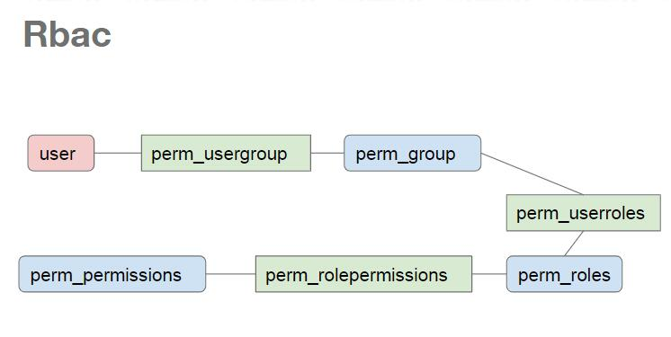

# Slimer RBAC

Slimer RBAC controlling based on PHP RBAC. [phprbac](phprbac.md)

> Slimer Rbac only support for group-roles relation for now, regarding the relationship table name **perm_userroles** which is the [phprbac](phprbac.md) defined, slimer use it to join the perm_group, will be changed soon.




## RBAC wrapper

Slimer provides an Rbac class extends PhpRbac to integrate with Slimer config. For now it only support for mysql or sqlite DB.

**Will have plan to extends to all the DBs which Medoo support for.**

```PHP
class Rbac extends PhpRbac
{
    
    public $container;
    public $target;
    
    public function __construct($unit_test = '',$container=null)
    {
        $this->container = $container;
        $host = $this->container['config']('db.default.server');
        $user = $this->container['config']('db.default.username');
        $pass = $this->container['config']('db.default.password');
        $dbname = $this->container['config']('db.default.database_name');
        if ($this->container['config']('db.default.database_type') == 'mysql'){
            $adapter="pdo_mysql";
        }else if($this->container['config']('db.default.database_type') == 'sqlite'){
            $adapter="pdo_sqlite";
        }else {
            $adapter=null;
        }
        $tablePrefix = $this->container['config']('rbac.rbac_table_prefix') ? $this->container['config']('rbac.rbac_table_prefix') : 'PREFIX_';
      
        require_once APP_ROOT . DS . 'vendor/owasp/phprbac/PhpRbac/src/PhpRbac/core/lib/Jf.php';
        
        $this->Permissions = Jf::$Rbac->Permissions;
        $this->Roles = Jf::$Rbac->Roles;
        $this->Users = Jf::$Rbac->Users;
    }

.............................................................


```

> Rbac service register

Slimer register Rbac in the container via the Auth/Provider

```PHP
        //----PhpRbac
        $container['rbac'] = function($c) {
            return new Rbac('',$c);
        };
```

> Rbac middlewrare

Slimer provide an Rbac middleware to do the permission checking. fetch the session user's groups and roles, and get the current route name to do the Perm checking for this route.

```PHP
$container['rbac_middleware'] = function ($c) {
            return new Middleware\RBAC($c);
        };


 public function __invoke(ServerRequestInterface $request, ResponseInterface $response, callable $next)
    {
        
        $route = $request->getAttribute('route');
        $groupName = \trim($route->getGroups()[0]->getPattern(),'/');
        $groupName = \str_replace('/','-',$groupName);
        $routeName = $route->getName();
        $rns = \explode('-',$routeName);
        $routeName=\end($rns);
        $routeConf = $this->config('routes')['/'.$groupName][$routeName];
        $user = $this->user;
        if (isset($user)){
            $permGroup=$user->getUserGroups();
            if ($permGroup != $user->get('perm_group')){
                $user->set('perm_group',$permGroup);
                $permGroupIds = [];
                foreach ($permGroup as $g){
                    \array_push($permGroupIds,$g['ID']);
                }
                $rs = $user->getUserRoles($permGroupIds);
                $user->set('roles',$rs);
                $this->session->set('user',$user->getData());
            }
        }
        if (isset($routeConf['perm'])){
            $request=$request->withAttribute('perm',$routeConf['perm']);
            if (isset($permGroup) && $permGroup != null){
                $permGroupIds = [];
                foreach ($permGroup as $group){
                    \array_push($permGroupIds,$group['ID']);
                }
                foreach ($routeConf['perm'] as $perm){
                    if ($this->rbac->check($perm,$permGroupIds)){
                        return $next($request, $response);
                    }
                }
            }
            return $this->appErrorHandler->error403($request,$response);
        }else{
            return $next($request, $response);
        }
    }

```


## RBAC initial Config

Please refer [rbac-config](rbac-config.md)

## RBAC command

Slimer provides several RBAC related commands to load the RBAC config.

- rbacinit

```shell
php index.php rbacinit --help

Description: Basic RBAC tables structure init, it will depends owasp/phprbac lib
rary
Avaliable parameter list:
--sql_path : The RBAC tables init sql path, the default=<vendor>/owasp/phprbac/P
hpRbac/database/mysql.sql
--dbType : Provide the current db type, default is mysql,: mysql|sqlite|pgsql
--dbEngine : The name of db engine in this App


// example
// php index.phhp rbacinit --dbType sqlite --dbEngine dbDefault

```

- rbacmanage

```shell

php index.php rbacmanage --help
Description: Basic RBAC tables structure init, it will depends owasp/phprbac lib
rary
Avaliable parameter list:
--role : The role title you want to manage
--type : The manage type, for now only support for add|delete|assign|unassign|sh
ow
--desc : The description
--perm : The perm title you want to manage
--parent : The parent title or path what you want to manage belong to
--recurisive : determind if to remove all of the descendant
--group : The role assigne to a specific groupName or groupId
--dbEngine : Once you put the groupName it would be need to search its id


 protected  $desc = "Basic RBAC tables structure init, it will depends owasp/phprbac library";
    protected  $params = ["--role" => "The role title you want to manage",
        "--type" => "The manage type, for now only support for add|delete|assign|unassign|show",
        "--desc" => "The description",
        "--perm" => "The perm title you want to manage",
        "--parent" => "The parent title or path what you want to manage belong to",
        "--recurisive" => "determind if to remove all of the descendant",
        "--group" => "The role assigne to a specific groupName or groupId",
        "--dbEngine" => "Once you put the groupName it would be need to search its id"
    ];

php index.php rbacmanage --dbEngine dbDefault --type show --role
root
-jenkins_admin
--jenkins_request
-art_admin
--art_request
-gerrit_admin
--gerrit_request
Successfully show the hierachical tree on the role=1

php index.php rbacmanage --dbEngine dbDefault --type show --perm
root
-jenkins_manage
--jenkins_req
-art_manage
--art_req
-gerrit_manage
--gerrit_req
-approval
-art_jenkins_list
Successfully show the hierachical tree on the permission=1

```

- rbacreset 

> This command will clean all of the current permission config in the DB, and initialized to [rbac-config](rbac-config.md)

```PHP
php index.php rbacreset --force
Successfully reset the RBAC tables (rolepermissions,roles,permissions,userroles)

Successfully init the roles from rbac.rbac_role_path config
Successfully init the permissions from rbac.rbac_perm_path config
Successfully init the rolepermissions from rbac.rbac_role_perm config

```