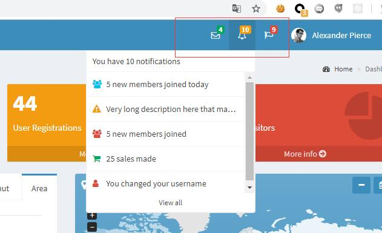
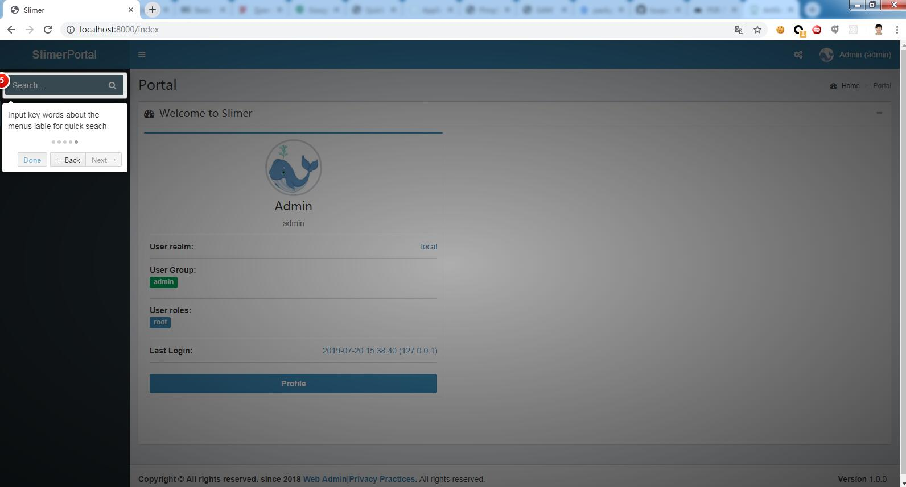

# Suit Config

### defination about suit

suit config is a file return a php array as below. It has all of the Slimer generic config items.It will be load automatic when request come.

### providers

Slimer based on [Slim Framework](http://www.slimframework.com) which has builtin DI container [Pimple](https://pimple.symfony.com/)
So the providers are the container registries which implements  Pimple\ServiceProviderInterface. So once we want to extend/inject service into the container.

So there is a 'providers' array in suit config to identify which Provider the app want to register. The item in this array is the Provider class path.

```
    'providers' => [
        '\Slimer\Html\Provider'
    ]
```

```PHP
class Provider implements ServiceProviderInterface
{
    public function register(Container $container)
    {
        $container['csrf_middleware'] = function (Container $container) {
            $guard = new \Slim\Csrf\Guard();
            if ($callable = $container['config']('csrf.failure_callable')) {
                $guard->setFailureCallable($callable);
            }
            
            return $guard;
        };
        
        $container['baseurl_middleware'] = function ($c) {
            return new \Slimer\Html\Middleware\Baseurl($c);
        };
        
        $container['flash'] = function (Container $container) {
            return new \Slim\Flash\Messages();
        };
        
        $container['view'] = function (Container $container) {
            $settings = $container['config']('html', []);
            $view = new \Slim\Views\Twig($settings['template_path'], [
                'cache' =### $settings['cache_path'],
                'auto_reload' =### $settings['cache_path']
            ]);
            
            // Instantiate and add Slim specific extension
            $basePath = \rtrim(\str_ireplace('index.php', '', $container['request']->getUri()->getBasePath()), '/');
            $view->addExtension(new \Slim\Views\TwigExtension($container['router'], $basePath));
            $view->addExtension(new \Knlv\Slim\Views\TwigMessages($container['flash']));
            $view->addExtension(new \Slimer\Html\CsrfExtension($container['csrf_middleware']));
            $view->addExtension(new \nochso\HtmlCompressTwig\Extension());
            
            $view->addExtension(new \Slimer\Html\SideBarExtension($container));
            $view->addExtension(new \Slimer\Html\NavBarExtension($container));
            return $view;
        };
    }
}
```

### middlewares

Slimer middlewares are built on top of [Slim middleware](http://www.slimframework.com/docs/v3/concepts/middleware.html) Middleware as per the naming, it could intercept the request processing according to the order it registed.

So the same as providers, we can have an array named middlewares to hold all of the middlewares we want to registry in the Slimer app.
```PHP
 'middlewares' => [
        'rbac_middleware',  //----checking the roles meet the route or not
        'auth_middleware',  //----fetch the use related roles in the request
	    'httpauth_middleware', //----basic authen before original auth
        'baseurl_middleware',
        'session_middleware', //----checking the request session info
	    'commandRunner',//----add cli command middleware
    ],
```

**The items in this array are the middlewares name in the container, which should be appeared in the above provider class. The order about the middleware is important, the first middleware means the most closer to the app, the last middleware like 'commandRunner' mean the first outer middleware that intercept the request.**


### namespaces

Namespaces config at here is designed for the controller namespace. We can try to expand it to other namespaces config at here.

**It is used when Router map all of the routes, according to the routes group name(the routes file name under routes folder)**

### tasks notices actions

The adminLTE template navigator Task, Notices, Actions data config part. we can fetch their data from backend when finished login, to update the $this->container['tasks']=[....] 

But for some permanent actions, we can initialize them here.




### commands

Slimer provide many builtin command which accept the command invoke Slimer to parse some operation from command line. It is based on commandRunner middleware Slim-cli-runner. [Slim-cli-runner](https://github.com/adrianfalleiro/slim-cli-runner)

```PHP
 // At here, we use commands array to map the Command class path and its command name which will be used when type the command name in console for command invoking.
 'commands' => [
        'cmd' => '\App\Command\Cmd',
        'sampletask' => '\App\Command\SampleTask',
        'dbinit' => '\App\Command\Dbinit',
        'rbacinit' => '\App\Command\RbacInit',
        'rbacreset' => '\App\Command\RbacReset',
        'rbacmanage' => '\App\Command\RbacManage',
    ],

        $container['commandRunner'] = function() use ($container) {
	    if (PHP_SAPI == 'cli') {
                global $argv;
                $argv[1] = strtolower($argv[1]);
            }
            return new \adrianfalleiro\SlimCLIRunner($container);
        };
```


### settings

This part is the Slimer bottom basic framework Slim original configuration settings, It will be parsed into Slim directly.

**Please refer [Slim Configuration](http://www.slimframework.com/docs/v3/objects/application.html#application-configuration)**

```PHP
 'settings' => [
        'displayErrorDetails' => ('prod' === \getenv('APP_ENV')) ? false : true,
        'determineRouteBeforeAppMiddleware' => true,
        'debug' => ('prod' === \getenv('APP_ENV')) ? false : true,
        'routerCacheFile' => ('prod' === \getenv('APP_ENV')) ? $cache_dir.'/routes.cache.php' : false,
        'renderer' => [
            'template_path' => APP_PATH . DS . 'Templates',
        ]
    ],
```


### httpauth

Slimer provide RESTAPI been invoked, it has httpauth builtin the username:password type authentication.

It takes advantage of httpauth_middleware to deal with RESTAPI invoking via httpauth. Please refer [Slim http basic authentication](https://github.com/tuupola/slim-basic-auth)

This third party library support add some hard code user/password authentication in the config. It also provide the "authenticator" handler class to overwrite/customize the ahtuentication logic.

**path:** means which path url need to enable http basic auth.

**passthrough:** the white list bypass the httpauth.

```PHP
//----we made a middleware to have default params with HttpBasicAuthentication class.
    $container['httpauth_middleware'] = function ($c) {
        $defaultParams=[
            "path"=>["/"],
            "paththrough"=> null,
            "authenticator" =>  new \Slimer\Auth\MixDBLdapAuthenticator(["container"=>$c])
        ];
        $defaultParams=array_merge($defaultParams,$c['config']('suit.httpauth'));
        return new \Slim\Middleware\HttpBasicAuthentication($defaultParams);
    };

 'httpauth' => [
        'secure'=>false, // enable https verification or not.
        'path'=> ['/api'],  //----the basic path need to do the httpauth
        'passthrough' => null, //----the white list bypass the httpauth
        "relaxed" => ["localhost", "127.0.0.1"], // work with secure=true to add a white list to avoid cert key verification.
    ],
```

### intro_date

This config works for the introduction feature appears when access the Slimer application. It will compare with the use last login time to decide if need to show introduction or not.

**intro_date:** define the introduction need to render date if the user last login time later than it.

**introductions** define the introduction contents, it will be used in the Templates.

> example below  we could use {{ getIntroduction('<the key of introductions>')}} to defin the 

```HTML
 <a href="#" class="logo" {{ getIntroduction('app') }}>
    <span class="logo-mini"><b>{{ container.suit_config.__invoke('suit.project_name','Slimer') }}</b></span>
    <span class="logo-lg"><b>{{ container.suit_config.__invoke('suit.project_name','Slimer') }}</b>Portal</span>
</a>
```

```PHP
 'intro_date' => '2018-12-31',  //-----if not setup will ignore the intro
    'introductions' => [
        'app'=>[
            'data-step' =>'1',
            'data-intro' => 'Slimer Guide, Please click skip or down to finish introduction.',
        ],
        'menuToggleButton' => [
            'data-step' =>'2',
            'data-intro' => 'Click here to toggle fold menu11111',
        ],
        'actions' => [
            'data-step' =>'3',
            'data-intro' => 'Several actions <br/> click show guidance to force introduction',
        ],
        'navBarUser' => [
            'data-step' =>'4',
            'data-intro' => 'Click here gos to Profile or Sign out',
            'data-position' => 'bottom-left-aligned'
        ],
        'quickSearch'=>[
            'data-step' =>'5',
            'data-intro' => 'Input key words about the menus lable for quick seach',
        ],
    ],
```


### menu visible

Slimer menu as default would show/hide according to the permision for this menu route, but we can disable menu_visible_by_perm to force show all menu items.

```PHP
menu_visible_by_perm=False
```

### Below are the sample suit file content

```
 [
    'providers' => [
        '\Slimer\Html\Provider',
        '\Slimer\Auth\Provider',
        '\Slimer\Orm\Provider',
        '\App\Provider\Provider',
    ],

    'middlewares' => [
        'rbac_middleware',  //----checking the roles meet the route or not
        'auth_middleware',  //----fetch the use related roles in the request
	    'httpauth_middleware', //----basic authen before original auth
        'baseurl_middleware',
        'session_middleware', //----checking the request session info
	    'commandRunner',//----add cli command middleware
    ],
    
    'namespaces' => [
        'controller' => '\\App\\Controller\\',
    ],
    
    'tasks'=### [],
    'notices'=>[],
    'actions' =### [
        [
            'route'=>'unintroed',
            'icon'=>'fa fa-lightbulb-o',
            'message'=>'Show guidance',
            'data'=>[]
        ]
    ],
    
    'commands' => [
        'cmd' => '\App\Command\Cmd',
        'sampletask' => '\App\Command\SampleTask',
        'dbinit' => '\App\Command\Dbinit',
        'rbacinit' => '\App\Command\RbacInit',
        'rbacreset' => '\App\Command\RbacReset',
        'rbacmanage' => '\App\Command\RbacManage',
    ],
    
    'settings' => [
        'displayErrorDetails' => ('prod' === \getenv('APP_ENV')) ? false : true,
        'determineRouteBeforeAppMiddleware' => true,
        'debug' => ('prod' === \getenv('APP_ENV')) ? false : true,
        'routerCacheFile' => ('prod' === \getenv('APP_ENV')) ? $cache_dir.'/routes.cache.php' : false,
        'renderer' => [
            'template_path' => APP_PATH . DS . 'Templates',
        ]
    ],
    
    'httpauth' => [
        'secure'=>false,
        'path'=> ['/api'],  //----the basic path need to do the httpauth
        'passthrough' => null, //----the white list bypass the httpauth
        "relaxed" => ["localhost", "127.0.0.1"],
    ],
    
    'version_key' => 'VERSION',
    'commitid_key' => 'COMMITID',
    'project_name' => 'Slimer', //----default is Slimer
    'intro_date' => '2018-12-31',  //-----if not setup will ignore the intro
    'introductions' => [
        'app'=>[
            'data-step' =>'1',
            'data-intro' => 'Slimer Guide, Please click skip or down to finish introduction.',
        ],
        'menuToggleButton' => [
            'data-step' =>'2',
            'data-intro' => 'Click here to toggle fold menu11111',
        ],
        'actions' => [
            'data-step' =>'3',
            'data-intro' => 'Several actions <br/> click show guidance to force introduction',
        ],
        'navBarUser' => [
            'data-step' =>'4',
            'data-intro' => 'Click here gos to Profile or Sign out',
            'data-position' => 'bottom-left-aligned'
        ],
        'quickSearch'=>[
            'data-step' =>'5',
            'data-intro' => 'Input key words about the menus lable for quick seach',
        ],
    ],
    'menu_visible_by_perm' => True
]
```